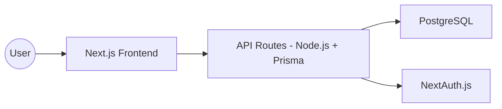

# Jobba-The-Hunt
*From backend Sith to frontend Jedi* ✨  

A full stack web app to track and manage job applications.  
Built with **Next.js, PostgreSQL, and modern DevOps practices**.  

---

## Table of Contents
- [Overview](#overview)
- [Project Docs](#-project-docs)
- [Tech Stack](#tech-stack)
- [MVP Features](#mvp-features)
- [Future Enhancements](#future-enhancements)
- [Why This Project?](#why-this-project)
- [Architecture Overview](#architecture-overview)
- [Setup](#setup)

---

## Overview
Jobba-The-Hunt helps track your job search pipeline with statuses, notes, and analytics—while showcasing full-stack + DevOps skills in action.

---

## Project Docs
- [](docs/design.md) → Architecture, schema, system design  
- [](docs/backlog.md) → Task planning & feature roadmap  
- [](docs/devlog.md) → Daily notes, decisions, learnings  

---

## Tech Stack
- **Frontend:** Next.js (App Router), React, TailwindCSS  
- **Backend:** Next.js API Routes (Node.js)  
- **Database:** PostgreSQL (via Prisma ORM)  
- **Authentication:** NextAuth.js  
- **CI/CD & Hosting:** GitHub Actions, Docker, Vercel  

---

## MVP Features
1. User signup/login  
2. Add/edit/delete job applications (Company, Role, Status, Notes)  
3. Status workflow: Applied → Screening → Interview → Offer/Rejected  
4. Dashboard view of all applications  

---

## Future Enhancements
- Tags & filters (e.g., Startup, Remote)  
- Analytics (conversion rate, offers vs rejections)  
- Resume/doc upload per application  
- Chrome extension for quick save from LinkedIn  

---

## Why This Project?
This app solves the chaos of job tracking with a clean workflow while demonstrating:
- **Modern full stack development (React + Next.js)**  
- **Backend APIs and database integration (PostgreSQL + Prisma)**  
- **Authentication and user management**  
- **CI/CD + deployment (GitHub Actions, Docker, Vercel)**  

---

## Architecture Overview

---
## Quick Start

[](https://nodejs.org/)  [](https://nextjs.org/)  [](https://www.npmjs.com/)

```bash
# 1. Clone the repository
git clone https://github.com/sujaybn/jobhunt-buddy.git

# 2. Move into the project directory\
cd jobba-the-hunt

# 3. Install dependencies
npm install

# 4. Start the development server
npm run dev
```
----
