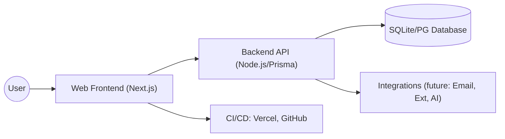
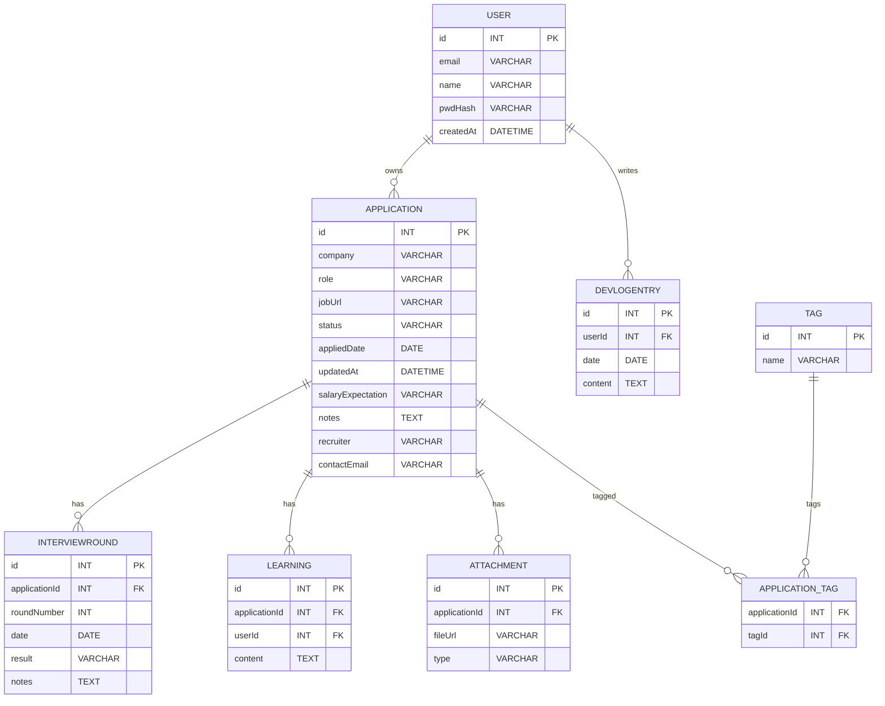
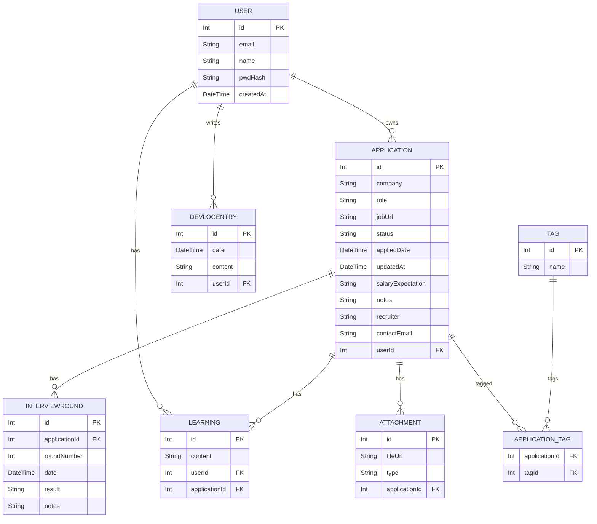
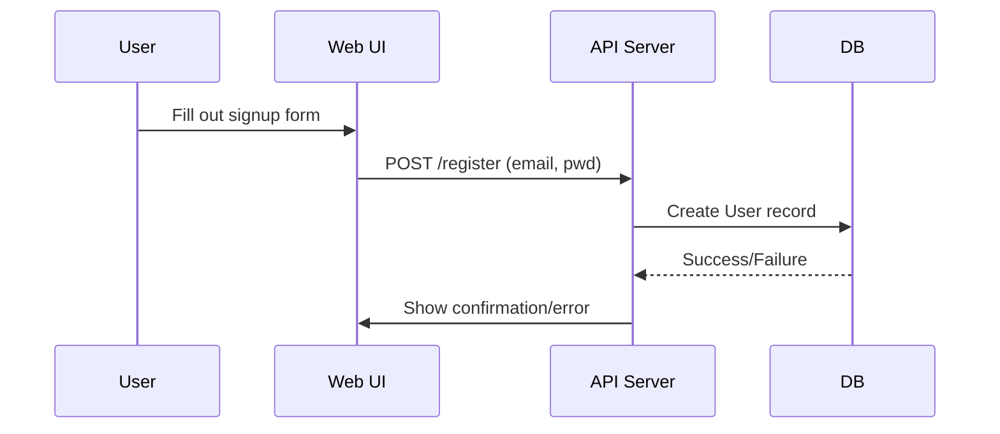
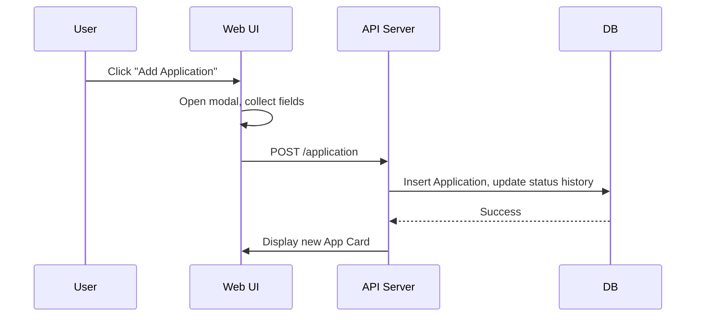
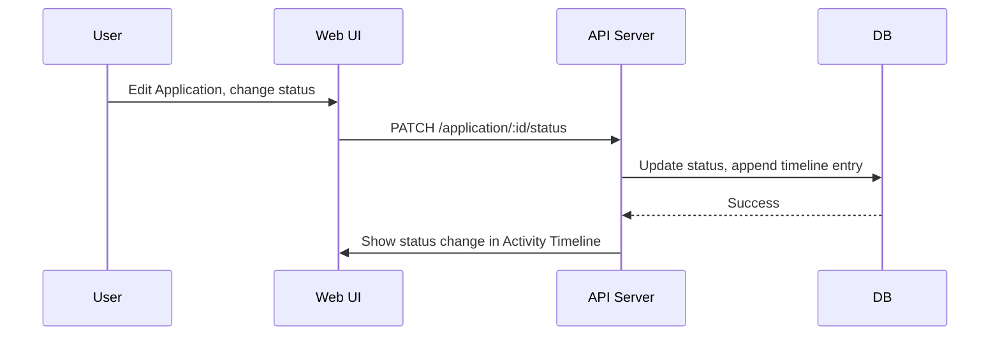
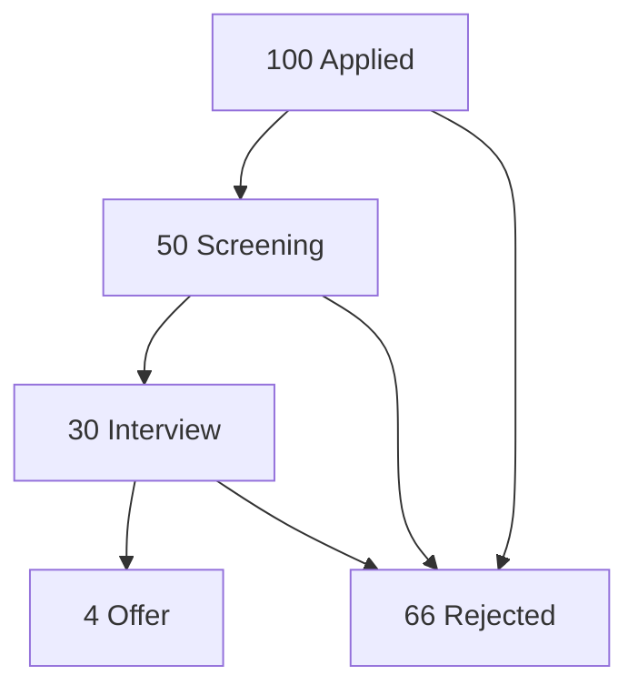

# JobbaTheHunt Design Document

## Elevator Pitch
JobbaTheHunt is a lightweight, personal product to track job applications, organize application-related notes and learnings, and measure job-search progress. Built for engineers and knowledge workers managing parallel applications, it’s a single place to track status, record interview notes and rejection reasons, and analyze conversion rates—while demonstrating full-stack and DevOps skills.

---

## Motivation
Engineers running active searches face recurring pain points:

- Job tracking is fragmented—spreadsheets, emails, memory.
- Interview notes + feedback are scattered, failures and improvements aren’t tracked.
- It’s challenging to measure progress (applied, interviewed, offers) or patterns.
- Reapplying/following-up lacks reminders or structure.

**JobbaTheHunt** solves these with structured tracking, a unified story per application, and health analytics.

---

## Target Users & Personas
- **Primary:** Individual contributors (SWE, PMs, designers) with active job searches.  
- **Secondary:** Early-career engineers seeking growth via analytics and reflection.  
- **Tertiary (future):** Recruiters, bootcamps, managers tracking analytics across cohorts.  

**Persona Example:** Senior SWE (7 years), hunting jobs, values organization and reflective growth, wants a portfolio-showcasing product.

---

## Core Value Proposition
- **Single Source of Truth:** All details, docs, notes per job application.  
- **Status Pipeline:** Track stages (Applied, Screening, Interview, Offer, Rejected) and timestamps.  
- **Post-Interview Learnings:** Tag and track root causes (e.g., system design, DSA gaps).  
- **Minimal Friction:** Fast-add, browser save.  
- **Export & Share:** Reports for interviews, coaching.  

---

## MVP Scope
- Email/password signup  
- CRUD Application (full data fields)  
- Status transitions, history  
- Dashboard (list, filter by status, sort)  
- Devlog/project README integration  
- Simple CI (Vercel + GitHub Actions), SQLite/Postgres  

**Phase 2+:** Tags, interview notes, rejection taxonomy, analytics, file attachments, reminders.  
**Phase 3 (future):** Extension, team features, AI feedback.  

---

## Architecture Overview
A Next.js frontend interacts with a Node/Prisma API, backed by SQLite/Postgres. DevOps handled via Vercel + GitHub Actions.

## Data Schema (Entity Relationship Diagram)

## Prisma Schema

## Key Use Cases & Sequence Diagrams
### Sign Up

### Add application

### Update status + timeline

### Analytics: Application funnel

## Security & Privacy
- **Auth:** bcrypt/argon2, NextAuth (+ JWT/sessions)  
- **Data isolation:** Row-level user access  
- **Secrets:** `.env` files, no DB credentials in repo  
- **Exports & deletion:** Full user control  
- **Future:** OAuth tokens encrypted, explicit consent for integrations  

---

## Constraints & Assumptions
- MVP is **single-user per account**, no collaboration  
- Free-tier infra: **Vercel + Neon/Supabase PG**  
- Fast developer iteration, minimal but polished UI  
- No heavy real-time/ML in MVP  

---

## Success Metrics
- Daily active users, **apps tracked per user**  
- **Conversion rates**: applications → screenings → interviews → offers  
- **Learnings logged** per application  
- **Behavioral metric:** actual daily use confirms product solving core pain  

---

## Acceptance Criteria
- End-to-end **sign-up, CRUD application, and status transition** works  
- Dashboard **lists, filters, and sorts** applications  
- Basic **README + design/devlog committed**  

---

## Mission Statement & Tagline
**JobHunt Buddy** is a personal job-application manager that captures each application’s lifecycle, interview notes, and learning points—enabling data-driven improvement of your job search. Built to be minimal, high-signal, and portfolio-ready.  

**Short tagline:**  
*Track applications. Capture learnings. Improve outcomes.*  
